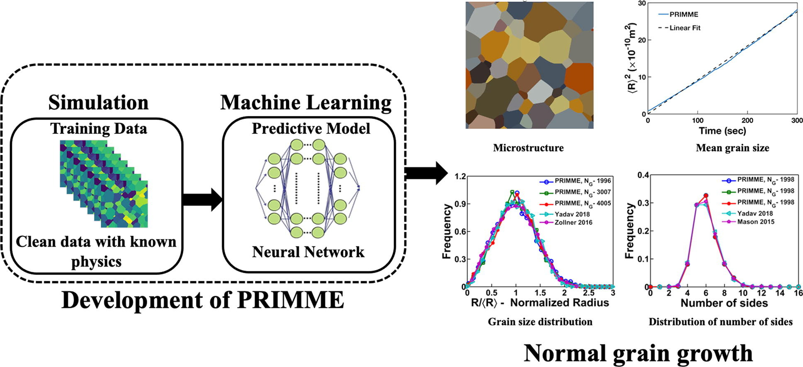

# Physics-Regulated Interpretable Machine Learning Microstructure Evolution (PRIMME)

<p align="center">
  
</p>

## Description:

Physics-Regularized Interpretable Machine Learning Microstructure Evolution (PRIMME): This code can be used to train and validate PRIMME neural network models for simulating isotropic microstructural grain growth.

To Access the sample Training Dataset from SPPARKS, you can download it from [here](https://www.dropbox.com/scl/fi/v47g45hc4pzw225t94n23/trainset_spparks_sz-257x257-_ng-256-256-_nsets-200-_future-4-_max-100-_kt-0.66-_cut-0.h5?rlkey=050y5yond3j81reexydb0opzq&st=uiauni5d&dl=0).

[Paper on the Model](https://doi.org/10.1016/j.matdes.2022.111032)

## Usage

There are two ways to run the program:

### Google Colab

See the following Colab link to run PRIMME remotely

[](https://colab.research.google.com/github/gabo0802/PRIMME-Readable/blob/main/PRIMME/run.ipynb)

### Local GUI

#### Dependencies

- Python 3.9 - 3.12
- For rest, see `requirements.txt`

#### Installation

Clone this repository and create virtual environment:

```bash
pip install virtualenv # if not done so already

git clone https://github.com/EAGG-UF/PRIMME.git
cd PRIMME
python3.9 -m venv venv
source venv/bin/activate
pip install -r requirements.txt

```

Run the GUI Application for Training and Running PRIMME

```python
cd PRIMME
python gui_application.py
```

## Visuals

### Isotropic Case

<div style="display: flex; justify-content: center; align-items: center;">
  &nbsp;&nbsp;&nbsp;&nbsp;
  &nbsp;&nbsp;&nbsp;&nbsp;
  
</div>
<p align="middle">
    <em >Training on mode filter(left), Training on MCP(mid) and Training on phase field (right).</em>
</p>
<be>

### Anisotropic Case

<div style="display: flex; justify-content: center; align-items: center;">
  &nbsp;&nbsp;&nbsp;&nbsp;
  
</div>
<p align="middle">
    <em >Training on mode filter(left) and Training on phase field (right).</em>
</p>
<be>

## Notes:

- This model is often trained of SPPARKS data, see its [GitHub](https://github.com/spparks/spparks) and [Documentation](https://spparks.github.io/) for more information.

## Contributors:

Weishi Yan, Joel Harley, Joseph Melville, Kristien Everett, Tian Zhihui, Lin Yang, Vishal Yadav, Michael Tonks, Amanda Krause, Gabriel Castejon, Manas Adepu.

## Affiliation:

1. University of Florida, SmartDATA Lab, Department of Electrical and Computer Engineering
2. University of Florida, Tonks Research Group, Department of Materials Science and Engineering

## Funding Sponsors:

U.S. Department of Energy, Office of Science, Basic Energy Sciences under Award \#DE-SC0020384
U.S. Department of Defence through a Science, Mathematics, and Research for Transformation (SMART) scholarship
